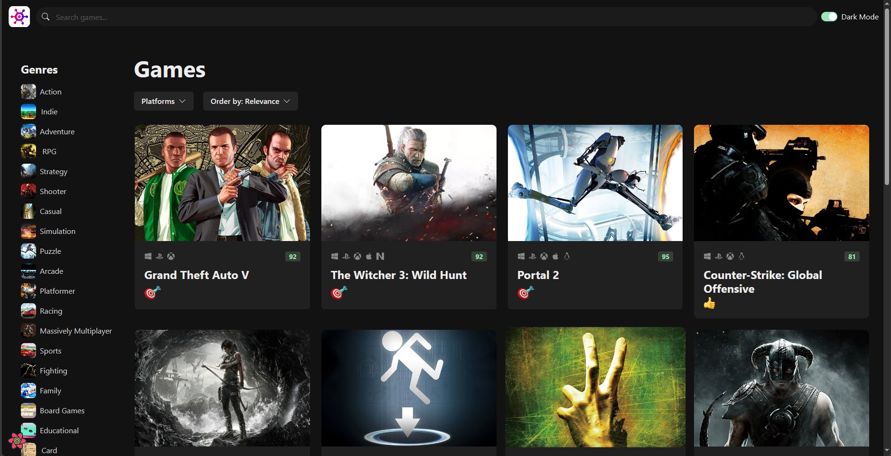
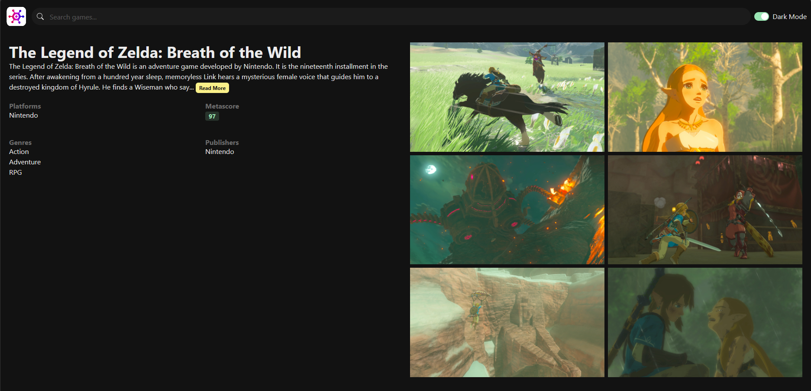

## About The Project

A video game catalog application allowing users to browse video games, categorize them by genre or platform, and access specific game details.

### Built With

- ![React][React-badge]
- ![TypeScript][TypeScript-badge]
- ![React-Query][React-Query-badge]
- ![Chakra][Chakra-badge]
- ![CSS3][CSS3-badge]

## Features

- Browse a catalog of video games.
- Access detailed information, gameplay videos, and images for individual games.
- Utilize filters to sort games by genre or platform.
- Search for specific video games.
- Toggle between dark and light modes.

## Screenshots

<!-- MARKDOWN LINKS & IMAGES -->
<!-- https://www.markdownguide.org/basic-syntax/#reference-style-links -->

[React-Query-badge]: https://img.shields.io/badge/-React%20Query-FF4154?style=for-the-badge&logo=react%20query&logoColor=white
[TypeScript-badge]: https://img.shields.io/badge/typescript-%23007ACC.svg?style=for-the-badge&logo=typescript&logoColor=white
[React-badge]: https://img.shields.io/badge/react-%2320232a.svg?style=for-the-badge&logo=react&logoColor=%2361DAFB
[Chakra-badge]: https://img.shields.io/badge/chakra-%234ED1C5.svg?style=for-the-badge&logo=chakraui&logoColor=white
[CSS3-badge]: https://img.shields.io/badge/css3-%231572B6.svg?style=for-the-badge&logo=css3&logoColor=white
